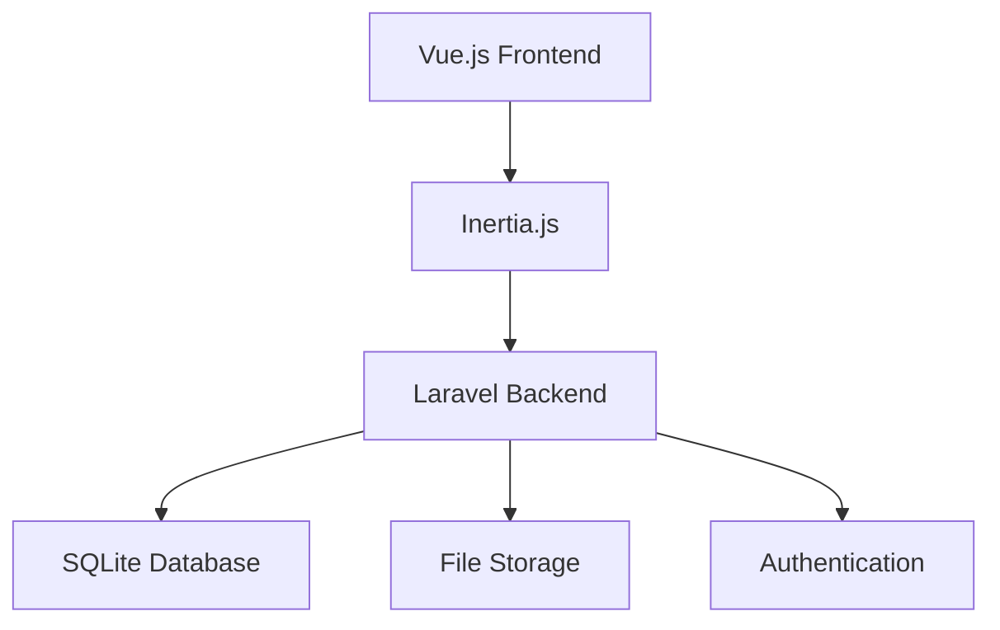

# 🎓 PhilexScholar | Your Digital Scholarship Hub

<div align="center">


</div>

> 🌟 Transforming scholarship management for the Philex Mines community through innovative digital solutions

## 📋 Table of Contents
<details>
<summary>Click to expand</summary>

- [✨ Overview](#-overview)
- [🎯 Key Features](#-key-features)
- [🏗 Architecture](#-architecture)
- [🛠 Tech Stack](#-tech-stack)
- [🚀 Getting Started](#-getting-started)
- [📚 Documentation](#-documentation)
- [🤝 Contributing](#-contributing)
- [📄 License](#-license)

</details>

## ✨ Overview

PhilexScholar revolutionizes scholarship management with a modern, user-friendly platform built on the powerful VILT stack (Vue.js, Inertia.js, Laravel, TailwindCSS). Our system streamlines the entire scholarship process from application to disbursement.

### 🎯 Key Features

<details>
<summary>👨‍🎓 For Students</summary>

- **Smart Application Portal**
  - Intuitive step-by-step forms
  - Document upload system
  - Real-time status tracking
  - Automated notifications

- **Student Dashboard**
  - Application progress monitoring
  - Document management
  - Payment schedule tracking
  - Direct communication channel
</details>

<details>
<summary>👨‍💼 For Administrators</summary>

- **Application Management**
  - Bulk application processing
  - Document verification system
  - Automated eligibility checks

- **Financial Management**
  - Streamlined disbursement
  - Payment tracking
  - Financial reporting

- **Program Administration**
  - Dynamic eligibility criteria
  - Custom workflow configuration
  - Analytics dashboard
</details>

## 🏗 Architecture



### 💾 Data Structure

```
📦 PhilexScholar
 ┣ 📂 Database
 ┃ ┣ 📜 Scholars
 ┃ ┣ 📜 Applications
 ┃ ┗ 📜 Payments
 ┣ 📂 Storage
 ┃ ┗ 📜 Documents
 ┗ 📂 Authentication
```

## 🛠 Tech Stack

<details>
<summary>Frontend Technologies</summary>

- **Vue.js 3** - Progressive JavaScript framework
- **Inertia.js** - Modern monolith architecture
- **TailwindCSS** - Utility-first CSS framework
</details>

<details>
<summary>Backend Technologies</summary>

- **Laravel 10** - PHP web framework
- **SQLite** - Lightweight database
- **Laravel Sanctum** - API authentication
</details>

## 🚀 Getting Started

### Prerequisites
```bash
php >= 8.1
composer
npm
sqlite3
```

### Installation
```bash
# Clone repository
git clone https://github.com/your-repo/philexscholar.git

# Install PHP dependencies
composer install

# Install Node dependencies
npm install

# Configure environment
cp .env.example .env
php artisan key:generate

# Setup database
php artisan migrate
php artisan db:seed

# Start development servers
php artisan serve
npm run dev
```

## 📚 Documentation

- [Scholar's Guide](docs/scholar-guide.md)
- [Administrator's Manual](docs/admin-guide.md)
- [API Documentation](docs/api-docs.md)
- [Development Guide](docs/dev-guide.md)

## 🤝 Contributing

We welcome contributions! Please check our [Contributing Guidelines](CONTRIBUTING.md).

1. Fork the repository
2. Create your feature branch
3. Commit changes
4. Push to branch
5. Open a Pull Request

## 📄 License

MIT License - See [LICENSE](LICENSE) file

---

<div align="center">
  <p>Built with ❤️ by the Philex Mines Technology Team</p>
  <p>
    <a href="https://github.com/IT-CS-NC-Philex-Scholars">GitHub</a> ·
    <a href="https://philexscholar.com">Website</a> ·
    <a href="mailto:support@philexscholar.com">Support</a>
  </p>
</div>
